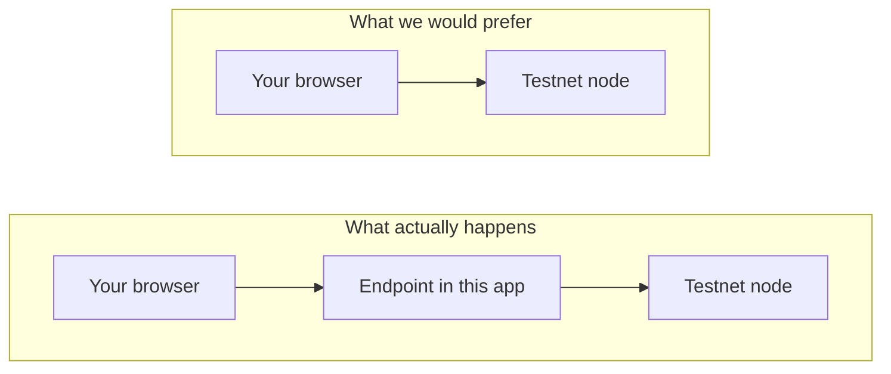
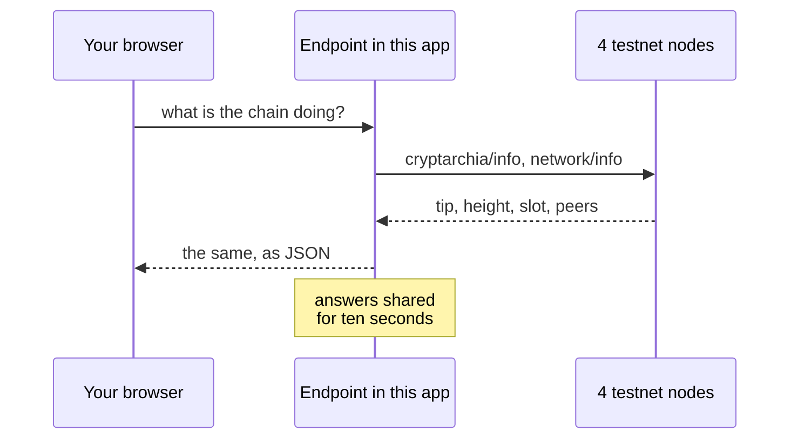

## What you are looking at

This reads the Logos Blockchain testnet **nodes** directly, not a block
explorer. Everything on the page is what the consensus layer reports about
itself.

- **Height and slot** are Cryptarchia's own counters for the base chain.
- **Chain tip** is the newest block the node has accepted.
- **Last irreversible block** is the newest one that can no longer be reorged
  away. The gap between the two is how far finality trails the tip.
- **Phase** is where the node sits in consensus, for example `Following`.

Four testnet nodes are queried, and the page says whether they agree on the
tip. Agreement is consensus working; disagreement would mean a fork or a node
falling behind.

## Where the data comes from

The nodes answer with `access-control-allow-origin: *`, so they would happily
take a call from your browser. The obstacle is not permission. They are served
over plain HTTP while this page is HTTPS, and a browser blocks that as mixed
content before the request is ever sent.

So a small read-only endpoint in this app makes the call instead. If the nodes
were ever served over HTTPS, that endpoint could be deleted and the page would
talk to them directly.

The nodes are someone else's testnet, so answers are cached for ten seconds and
the page polls every fifteen. A node that does not answer is left out rather
than taking the whole view down.

## Reading the liveness badge

The nodes report `state: "Online"` whether or not blocks are being produced,
so that field only tells you the process is running. The badge at the top
instead watches when the height last changed, which is the honest question.

Measured cadence on this testnet is a block every 30 to 90 seconds, so a
minute of quiet is ordinary and the badge stays green through it. It only
turns if the height has not moved for five minutes.

## What is not here

No wallet, nothing to send, no account of your own. The nodes expose one write
surface, `/mempool/add/tx`, and nothing here goes near it. Submitting a
transaction would mean holding a key in the browser and building a proof for
it, which is a different piece of work entirely.

| What | Where |
| --- | --- |
| The endpoint | `src/app/api/chain/route.ts` |
| Shapes and liveness | `src/lib/cryptarchia.ts` |
| Node addresses and API surface | `docs/network-access.md` |
