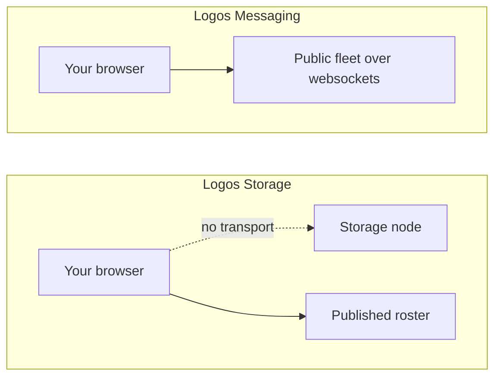

## What this is, and what it is not

This shows **who runs the Logos Storage network**, read live from the roster
the project publishes. It does not store anything, and there is nothing here to
upload a file to. That limit is worth stating plainly, because a storage demo
that cannot store looks like a broken one until you know why.

## Why you cannot upload

A browser cannot join Logos Storage. Discovery happens over discv5, which is
UDP, and content moves over libp2p TCP. A browser has neither, and the storage
documentation never mentions a websocket transport, so there is nothing to ask
for.

That is the difference from messaging, where two things were true at once: a
browser light client exists, and there is a public fleet speaking a transport
browsers have.

Nor is there a public node to call instead. Twelve nodes were checked across
both fleets and every one refuses a connection on its API port, which is the
design rather than an oversight: the storage documentation is entirely about
running your own node.

## What is live

The roster itself, published at `fleets.logos.co`. It sends no CORS header, so
the browser is not allowed to read it directly and a small route handler fetches
it instead and passes it through unchanged.

Each entry carries the node's host, its libp2p peer id, its address, and the
keys another node needs to reach it. Two fleets are published, and
`logos.test` is the populated one.

## The mix relay column

These storage nodes double as **mix relays**. The official guide for running a
node builds its mix pool straight out of this roster, mapping every entry to a
relay with its `mixPubKey`. So the list you are looking at is also how a
joining node finds the mix network.

## About the role codes

The roster publishes a `role` of `mp` or `rs`. No source in any Logos
repository defines what they stand for, so they are shown exactly as published
rather than expanded into a guess.

## What would change this

Storage's marketplace runs on Ethereum contracts, and a browser can read an
Ethereum RPC directly. That would allow a real view of storage deals with no
node and no proxy. The contract address is known and so is the chain, Status
Network Sepolia. The one RPC published for that chain no longer resolves, which
is the only thing standing in the way.

| What | Where |
| --- | --- |
| Roster shapes | `src/lib/storage-fleet.ts` |
| Everything checked, and the open lead | `docs/storage-research.md` |
